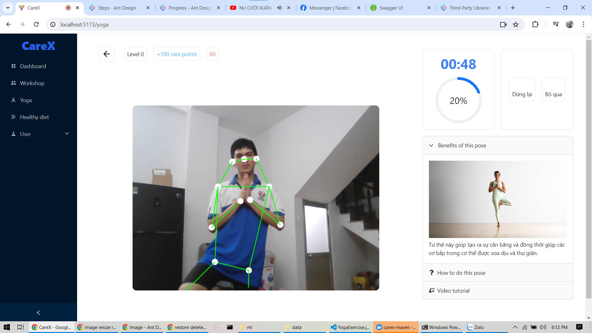
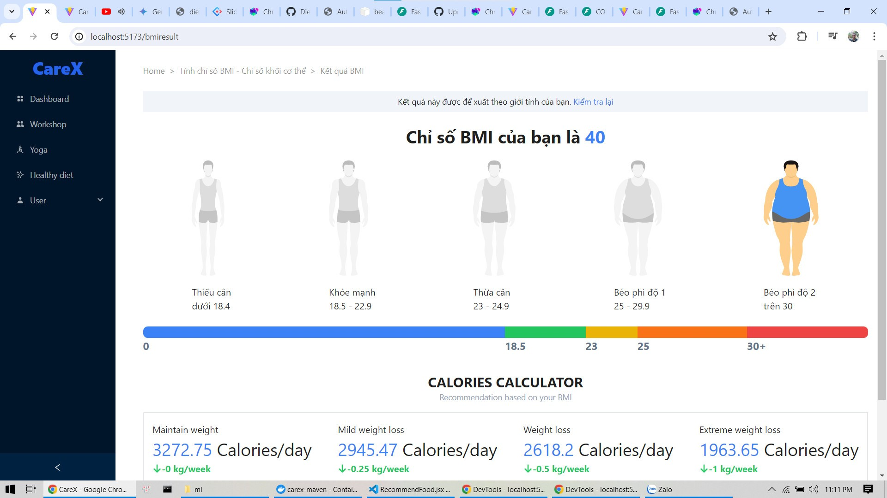

# CareX

CareX is a comprehensive web app designed to empower you to take charge of your well-being, focusing on aspects that you can actively control. It supports both physical and mental health by providing personalized guidance on balanced nutrition and in-home yoga practices to help you rediscover inner peace.

When life gets overwhelming, CareX is your ideal companion. It offers a diverse range of healing workshops and knowledge-sharing sessions tailored to your interests, helping you alleviate stress and enhance your quality of life.


[](https://github.com/lochuung/CareX/issues)
[](https://github.com/lochuung/CareX/stargazers)


[](https://github.com/lochuung/CareX)

## Features
- In-Home Yoga Practices with Yoga dectection
- Personalized Meal Suggestions
- Healing Workshops and Knowledge Sharing
- User-Friendly Interface

## Built With

- Frontend: React.js, Next.js, Tailwind CSS, Vite,...
- Backend: Spring Boot, Spring Framework, Hibernate, FastAPI, Uvicorn, MySQL, JWT,...
- Data Analysis: TensorFlow,...

## Setup and Deployment

### Prerequisites
- Docker
- Docker Compose

### Setup
1. Clone the repository
```bash
git clone
```
2. Change directory
```bash 
cd CareX
```
3. Edit the environment variables in the `.env` file in the root directory
4. Edit the environment variables in the `.env` file in the `frontend` directory
5. Run the deployment script
```bash
./deploy.sh
```

## Screenshots

### Yoga Detection
<p align="center">
    
</p>

### Meal Suggestions
<p align="center">
    
</p>

## Contributing

Pull requests are welcome. For major changes, please open an issue first to discuss what you would like to change.

## License

[MIT](https://choosealicense.com/licenses/mit/)
